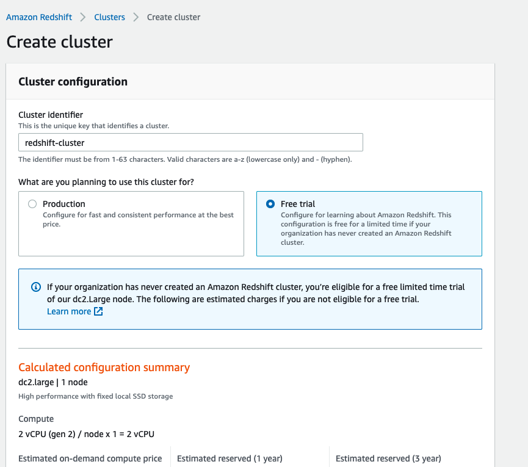

# **Лабараторная работа по Amazone Redshift**

Перед практической частью, важно понять как данный сервис устроен и для решениея каких задач может применятся. После этого сможеим перейти к практической части.

## **Архитектура Redshift**


Leader node:
- ендпоинт для отпарвки SQL запросов
- Координирует выполнение параллельного запроса
- хранит метаданные

Compute node:
- несколько узлов выполняют запросы параллельно
- выделенный CPU, память и локальное хранилище
- увеличивать / уменьшать масштаб, вверх / вниз
- резервные копии делаются параллельно


Slices:
- часть памяти и диск
- данные загружаются параллельно
- количество срезов зависит от узла

Выслокая скорость внутри хранилища Redshift 
- 10 GigE mesh

База данных с массовой параллельной обработкой:
- данные, хранящиеся на нескольких узлах
- выделенный CPU, память и локальное хранилище
- ["Shared nothing"](https://en.wikipedia.org/wiki/Shared-nothing_architecture) архитектура

*База данных столбцов - это система управления базами данных, в которой таблицы данных хранятся в виде столбцов, а не строк.*

*Эффективное чтение и запись данных на дисковое хранилище и обратно, чтобы сократить время, необходимое для возврата результатов запроса:*
- *уменьшение количества данных, которые необходимо записать и прочитать на диск и с диска*
- *избежать сканирования и отбрасывая ненужные строки*

Преимущества:
- Запросы по нескольким столбцам
- агрегирование данных
- сжатие

Не стоит использовать:
- точечные запросы
- маленький обьем данных
- большые бинарные обьекты
- обработка онлайн-транзакций


## **Дизайн таблиц**

**Distribution styles**


- равномерное распределение - строки распределяются по срезам независимо от значений в конкретном столбце
    когда использовать:
    - нет объединений, ограниченный параллелизм, где KEY и All не являются четким выбором 
    - строки распределяются по срезам независимо от значений в конкретном столбце
    - стиль распределения по умолчанию


- распределение по ключам:
    - равномерно распределять данные по срезам
    - совместить совпадающие строки в одном срезе
        когда использовать:
        - таблицы, используемые в соединениях
        - большие таблицы фактов в звездообразной схеме
        - Равномерно распределяйте данные по срезам
        - совместить совпадающие строки в одном срезе


- ALL распределение - копия каждой таблицы раздается каждому Compute node
    когда использовать:
    - данные не меняются
    - таблицы разумного размера (несколько миллионов строк)
    - нет общего ключа распределения


**Ключи сортировки**

Amazone Redshift хранит данные на диске в отсортированном порядке в соответствии с ключом сортировки. Оптимизатор запросов Amazone Redshift использует порядок сортировки при определении оптимальных планов запросов.

- размер блока 1 MB
- Zone Maps (минимальные и максимальные значения)

Нам нужно загрузить данные в порядке сортировки или использовать команду vacaume. Если данные не отсортированы, они будут прочитаны от начала до конца.

варианты ключей сортировки:
*Compound* 
- *\+*:
    - Столбцы, перечисленные в определении ключа сортировки
    - По умолчанию
    - JOINS
    - ORDER BY; GROUP BY
    - PARTITION BY; ORDER BY оконые функции
- *\-*:
    - большая загрузка данных вызывает несортированный регион
    - Vacuum и Analyze операции
    - таблицы, отсортированные по столбцам, перечисленным в порядке ключа сортировки
    - низкая производительность запроса не включает столбец первичной сортировки  

*Interleaved*
- равный вес для каждого столбца в ключе сортировки
- несколько запросов / разные фильтры
- операции по обслуживанию таблицы - загрузка данных/vacuum операции проходят медленее
- лучше использовать на большых таблицах - > 100 милионов+ строк [*](https://aws.amazon.com/blogs/big-data/optimizing-for-star-schemas-and-interleaved-sorting-on-amazon-redshift/)
     
хорошие варианты для ключей сортировки:
- TIMESTAMP колонка для последных данных
- столбцы, которые используются в условиях BETWEEN или операторах равенства
- колонки котоорые задействованые в JOINS - некоторые колонки могут быть использованы как ключ разпридиления и сортировки

**Сжатия**

Это важно для хранения меньшего количества данных, чтобы снизить затраты и уменьшить количество операций ввода-вывода диска

[Compression encodings](https://docs.aws.amazon.com/redshift/latest/dg/c_Compression_encodings.html)

**Constraints**

Ограничения на уровне столбца:
- PRIMARY KEY - не требуется
- FOREIGN KEY - не требуется
- UNIQUE - не требуется
- NOT NULL/NULL - требуется
- REFERENCES - не требуется

**Управление нагрузкой**
- Управляйте долго выполняющимися запросами / короткими запросами отдельно
- создавайте правила для маршрутизации запросов к очередям
- конфигурация распределения памяти по очередям
- улучшайте производительность и опыт

Лимиты:
 - concurrent user connections: 500
 - total concurrency level for all user-defined queues: 50
 - numbers of user-defined queues: 8
 - superuser queue: 1
 - default concurency per queue: 5

Статические свойства управления нагрузкой(для приминения,требуют перезагрузки кластера):
- User Groups
- User Groups Wildcard
- Query Groups
- Query Groups Wildcard

Динамические свойства управления нагрузкой:
- concurrency
- persentage of memory to use per queue
- timeout

[Working with short query acceleration](https://docs.aws.amazon.com/redshift/latest/dg/wlm-short-query-acceleration.html)

**Загрузка данных**

Количество срезов должно быть равно или кратно числом срезов
 *4 slices - 4 или 8 файлов*

Вы можете ускорить загрузку файлов, сжав большие файлы с помощью gzip, lzop, bzip2
Оптимальный размер файла для загрузки - от 1MB до 1Gb

что такое Manifest:
- загружает только возтребованые файлы
- загружает файлы из разных buckets
- загружает файлы с разных префиксом
- в формате JSON

системные ошибки таблицы могут быть проверены:
- STL_LOAD_ERRORS
- STL_LOADERROR_DETAIL

что такое UPSERT:
- мердж опирации (UPDATE или INSERT)
- Redshift НЕ потжержует UPSERT

Вы можете заменить эту функциональность промежуточными таблицами:
- обычно для замены существующей строки:
    - заменить все данные в целевой таблице
    - использовать все строки в промежуточной таблице, объединить в целевую таблицу
    - столбцы целевой и промежуточной таблиц совпадают

## **Слздание кластера**

1. Найдите в сервисах Amazon Redshift и нажмите кнопку Создать кластер.
2. Введите идентификатор своего кластера, выберите бесплатный пробный план, в разделе введите имя пользователя и пароль администратора. Затем нажмите кнопку с созданием кластера.


3. По умолчанию вы получите базу данных "dev". И получите доступ к кластеру только внутри VPC. Для получение доступа к кластеру с локального компютера, вам следует перейти на вкладку "properties" -> "Network and security settings" секцию и сделать Publicly accesible - доступной. Также необходимо открыть порт 5439 в вашей VPC security group. Когда все доступа предостввите получите доступ к Amazone Redshift кластеру локально. Для работы с запросами можите использовать любое приложение, я рекомендую [DBeaver Community edition](https://dbeaver.io/download/).
4. Рекомендация для выбора инстанса для нод кластера -  У вас должно быть свободное место в 2–2,5 раза больше размера вашего самой большой таблици.
5. Создавайте таблицы без сжатия, стиля распределения или ключа сортировки:
 ```sql
  CREATE TABLE orders_nocomp
(
	o_orderkey BIGINT NOT NULL,
	o_custkey BIGINT NOT NULL,
	o_orderstatus CHAR(1) NOT NULL,
	o_totalprice NUMERIC(12, 2) NOT NULL,
	o_orderdate DATE NOT NULL,
	o_orderpriority CHAR(15) NOT NULL,
	o_clerk CHAR(15) NOT NULL,
	o_shippriority INTEGER NOT NULL,
	o_comment VARCHAR(79) NOT NULL);


CREATE TABLE lineitem_nocomp
(
	l_orderkey BIGINT NOT NULL,
	l_partkey BIGINT NOT NULL,
	l_suppkey INTEGER NOT NULL,
	l_linenumber INTEGER NOT NULL,
	l_quantity NUMERIC(12, 2) NOT NULL,
	l_extendedprice NUMERIC(12, 2) NOT NULL,
	l_discount NUMERIC(12, 2) NOT NULL,
	l_tax NUMERIC(12, 2) NOT NULL,
	l_returnflag CHAR(1) NOT NULL,
	l_linestatus CHAR(1) NOT NULL,
	l_shipdate DATE NOT NULL,
	l_commitdate DATE NOT NULL,
	l_receiptdate DATE NOT NULL,
	l_shipinstruct CHAR(25) NOT NULL,
	l_shipmode CHAR(10) NOT NULL,
	l_comment VARCHAR(44) NOT NULL);
 ```
6. Для использования функционалом Manifest файла измените файл lineitem.manifest и orders.manifest из files директории, добавив имя вашего bucket и загрузите их в bucket S3.

7. Загружать данные в таблицы без сжатия, стиля распределения или ключа сортировкиs:

```bash
copy orders_nocomp from 's3://your bucket/redshiftdata/orders.manifest' iam_role 'arn:aws:iam::your account number:role/your role' delimiter '|' manifest compupdate off;
copy lineitem_nocomp from 's3://your bucket/redshiftdata/lineitem.manifest' iam_role 'arn:aws:iam::your account number:role/your role' delimiter '|' manifest compupdate off;
```

8.  Запрос таблиц без сжатия, стиля распределения или ключей сортировки:

```sql
SELECT
    l_shipmode,
    sum(case
        when o_orderpriority = '1-URGENT'
            OR o_orderpriority = '2-HIGH'
            then 1
        else 0
    end) as high_line_count,
    sum(case
        when o_orderpriority <> '1-URGENT'
            AND o_orderpriority <> '2-HIGH'
            then 1
        else 0
    end) AS low_line_count
FROM
    orders_nocomp,
    lineitem_nocomp
WHERE
    o_orderkey = l_orderkey
    AND l_shipmode in ('AIR', 'SHIP')
    AND l_commitdate < l_receiptdate
    AND l_shipdate < l_commitdate
    AND l_receiptdate >= date '1992-01-01'
    AND l_receiptdate < date '1996-01-01' + interval '1' year
GROUP BY
    l_shipmode
ORDER BY
    l_shipmode;
```

9.  Создавайте таблицы со сжатием, без стиля распределения или ключей сортировки:

```sql
CREATE TABLE orders_comp
(
	o_orderkey BIGINT NOT NULL,
	o_custkey BIGINT NOT NULL,
	o_orderstatus CHAR(1) NOT NULL,
	o_totalprice NUMERIC(12, 2) NOT NULL,
	o_orderdate DATE NOT NULL,
	o_orderpriority CHAR(15) NOT NULL,
	o_clerk CHAR(15) NOT NULL,
	o_shippriority INTEGER NOT NULL,
	o_comment VARCHAR(79) NOT NULL);


CREATE TABLE lineitem_comp
(
	l_orderkey BIGINT NOT NULL,
	l_partkey BIGINT NOT NULL,
	l_suppkey INTEGER NOT NULL,
	l_linenumber INTEGER NOT NULL,
	l_quantity NUMERIC(12, 2) NOT NULL,
	l_extendedprice NUMERIC(12, 2) NOT NULL,
	l_discount NUMERIC(12, 2) NOT NULL,
	l_tax NUMERIC(12, 2) NOT NULL,
	l_returnflag CHAR(1) NOT NULL,
	l_linestatus CHAR(1) NOT NULL,
	l_shipdate DATE NOT NULL,
	l_commitdate DATE NOT NULL,
	l_receiptdate DATE NOT NULL,
	l_shipinstruct CHAR(25) NOT NULL,
	l_shipmode CHAR(10) NOT NULL,
	l_comment VARCHAR(44) NOT NULL);
```
10.  Загружать данные в таблицы со сжатием, без стиля распределения или ключей сортировки:

```sh
copy orders_comp from 's3://your bucket/redshiftdata/orders.manifest' iam_role 'arn:aws:iam::your account number:role/your role' delimiter '|' manifest;
copy lineitem_comp from 's3://your bucket/redshiftdata/lineitem.manifest' iam_role 'arn:aws:iam::your account number:role/your role' delimiter '|' manifest;
```

11. Запрос таблиц со сжатием, без стиля распределения или ключей сортировки:

```sql
SELECT
    l_shipmode,
    sum(case
        when o_orderpriority = '1-URGENT'
            OR o_orderpriority = '2-HIGH'
            then 1
        else 0
    end) as high_line_count,
    sum(case
        when o_orderpriority <> '1-URGENT'
            AND o_orderpriority <> '2-HIGH'
            then 1
        else 0
    end) AS low_line_count
FROM
    orders_comp,
    lineitem_comp
WHERE
    o_orderkey = l_orderkey
    AND l_shipmode in ('AIR', 'SHIP')
    AND l_commitdate < l_receiptdate
    AND l_shipdate < l_commitdate
    AND l_receiptdate >= date '1992-01-01'
    AND l_receiptdate < date '1996-01-01' + interval '1' year
GROUP BY
    l_shipmode
ORDER BY
    l_shipmode;
```

12. Создание таблиц со сжатием, стилем распределения и ключами сортировки:
```sql
CREATE TABLE orders
(
	o_orderkey BIGINT NOT NULL DISTKEY,
	o_custkey BIGINT NOT NULL,
	o_orderstatus CHAR(1),
	o_totalprice NUMERIC(12, 2),
	o_orderdate DATE NOT NULL,
	o_orderpriority CHAR(15) NOT NULL,
	o_clerk CHAR(15) NOT NULL,
	o_shippriority INTEGER NOT NULL,
	o_comment VARCHAR(79) NOT NULL
)
SORTKEY
(
	o_orderdate
);

CREATE TABLE lineitem
(
	l_orderkey BIGINT NOT NULL DISTKEY,
	l_partkey BIGINT NOT NULL,
	l_suppkey INTEGER NOT NULL,
	l_linenumber INTEGER NOT NULL,
	l_quantity NUMERIC(12, 2) NOT NULL,
	l_extendedprice NUMERIC(12, 2) NOT NULL,
	l_discount NUMERIC(12, 2) NOT NULL,
	l_tax NUMERIC(12, 2) NOT NULL,
	l_returnflag CHAR(1) NOT NULL,
	l_linestatus CHAR(1) NOT NULL,
	l_shipdate DATE NOT NULL,
	l_commitdate DATE NOT NULL,
	l_receiptdate DATE NOT NULL,
	l_shipinstruct CHAR(25) NOT NULL,
	l_shipmode CHAR(10) NOT NULL,
	l_comment VARCHAR(44) NOT NULL
)
SORTKEY
(
	l_shipdate
);
```

13. Загружать данные в таблицы со сжатием, стилем распределения и ключами сортировки:

```sh
copy orders from 's3://your bucket/redshiftdata/orders.manifest' iam_role 'arn:aws:iam::your account number:role/your role' delimiter '|' manifest;
copy lineitem from 's3://your bucket/redshiftdata/lineitem.manifest' iam_role 'arn:aws:iam::your account number:role/your role' delimiter '|' manifest;
```

14. Запрос таблиц СО сжатием, стилем распределения и ключами сортировки:

```sql
SELECT
    l_shipmode,
    sum(case
        when o_orderpriority = '1-URGENT'
            OR o_orderpriority = '2-HIGH'
            then 1
        else 0
    end) as high_line_count,
    sum(case
        when o_orderpriority <> '1-URGENT'
            AND o_orderpriority <> '2-HIGH'
            then 1
        else 0
    end) AS low_line_count
FROM
    orders,
    lineitem
WHERE
    o_orderkey = l_orderkey
    AND l_shipmode in ('AIR', 'SHIP')
    AND l_commitdate < l_receiptdate
    AND l_shipdate < l_commitdate
    AND l_receiptdate >= date '1992-01-01'
    AND l_receiptdate < date '1996-01-01' + interval '1' year
GROUP BY
    l_shipmode
ORDER BY
    l_shipmode;
```

15. Сравните скорость запроса. И не стесняйтесь загружать свои наборы данных и делать собственные запросы.