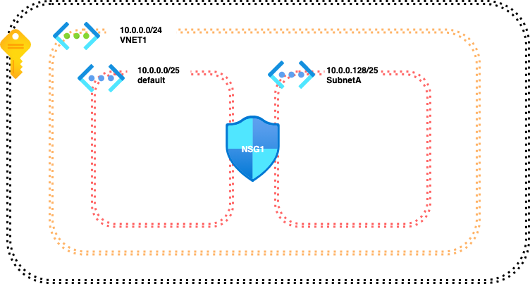
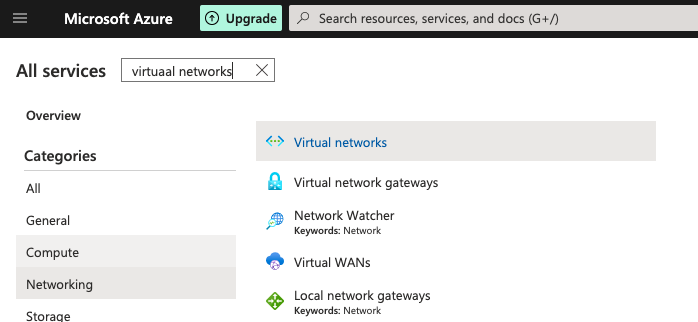
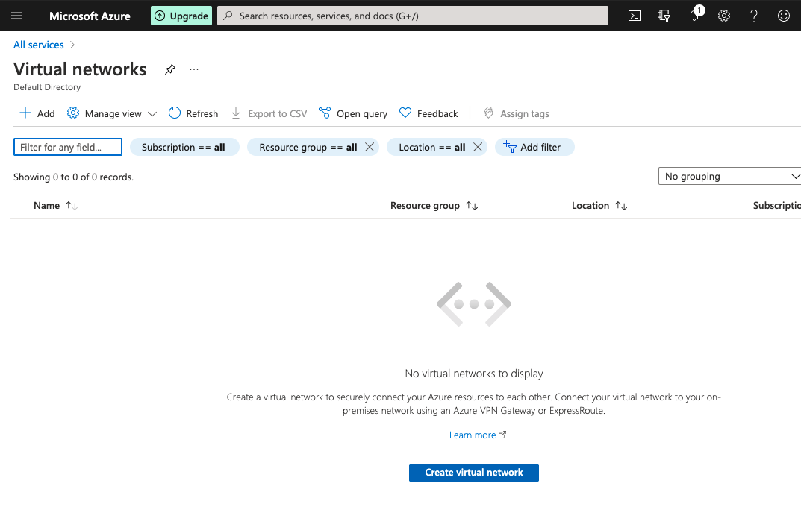
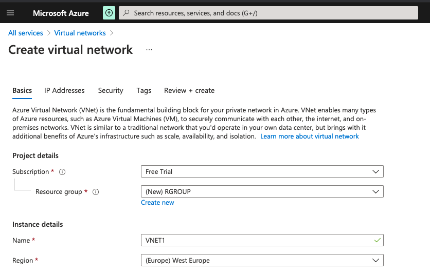
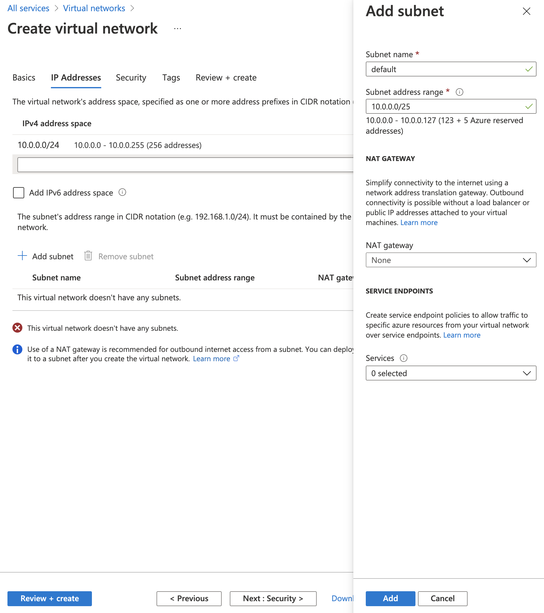
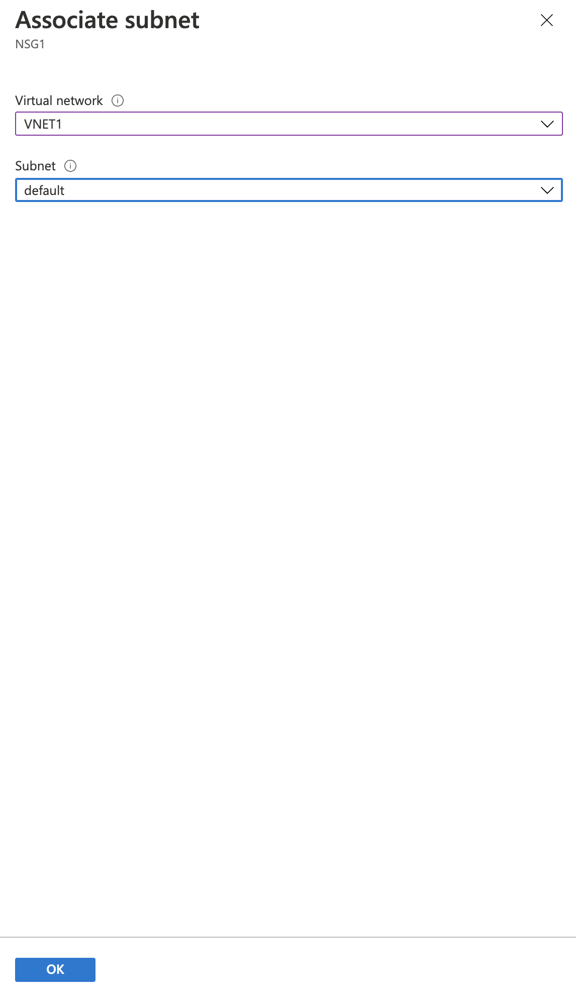

# **Создание Azure Virtual network**

## **Вступление**

В этом практическом занятии мы будем использовать Azure Portal для создания и использования виртуальной сети. Мы войдем на Azure Portal и будем использовать его для создания виртуальной сети, подсетей и группы безопасности сети. После завершения этой практической лабораторной работы мы приобретем опыт, необходимый для создания и использования вашей первой виртуальной сети с помощью Azure Portal.

## **Архитектура проекта**

## **Руководство по решению**

### **Войдите на Azure Portal**

Предварительно создайте бесплатную учетную запись. Ее можно создать [здесь](https://azure.microsoft.com/ru-ru/free/).

### **Создайте виртуальную сеть и основную подсеть**

1. Перейдите на вкладку со всеми сервисами - [ссылка](https://portal.azure.com/#allservices)
2. В строке поиска введите "virtual network" и выберите **Virtual Network** из полученых результатов

3. Нажмите синюю кнопку **Create virtual network** внизу страницы.

4. На странице _Create virtual network_ настройте следующие параметры:
- В _Resource group_, создайте новую группу ресурсов «RGROUP».
- В поле _Name_, введите "VNET1"
- В разделе _Region_, выберите (Europe) West Europe

5. Затем нажмите кнопку  **Next: IP Addresses >** внизу
6. Обновите адресное пространство до **10.0.0.0/24**
7. Создайте новую подсеть, нажав кнопку **+ Add subnet**
8. На панели **Add subnet**, которая появляется справа, настройте новую подсеть:
- В поле _Subnet name_ введите "default"
- В поле _Subnet address range_, enter "10.0.0.0/25"
- Нажмите синюю кнопку Add внизу

9. На странице _Create virtual network page_ нажмите **Next: Security >**
10. Оставьте эти настройки по умолчанию и нажмите **Next: Tags >**
11. Нажмите синюю кнопку **Review + create >**
12. Нажмите синюю кнопку **Create**
13. По завершении развертывания щелкните **Go to resource**, чтобы просмотреть информацию об этом ресурсe

### **Создайте дополнительную подсеть**

1. В меню слева выберите **Subnets** в разделе _Settings_
2. Нажмите **+ Subnet** вверху страницы.
3. В боковом меню _Add subnet_ слева настройте следующие параметры:
- В поле _Name_ введите "SubnetA"
- В поле _Address range_ введите "10.0.0.128/25"
- Оставьте все остальное по умолчанию
4. Нажмите кнопку **Save**

### **Создание и связывание группы сетевой безопасности**

#### **Создать новую Network Security Group**

1. Введите "Network security group" в строку поиска вверху
2. Щелкните **Network Security Group** в разделе _Services_
3. Нажмите кнопку **Create network security group** в нижней части окна _Network security group_ страницы
4. На странице _Create network security group_ настройте следующие параметры:
- В _Resource group_ выберите предварительно подготовленную группу ресурсов из раскрывающегося списка
- **Name**: "NSG1"
- **Region**: такой же как "VNET1"
5. Нажмите кнопку **Review + create**
6. Нажмите кнопку **Create**
7. По завершении развертывания нажмите кнопку **Go to resource**
8. В меню слева в разделе _Settings_ щелкните **Subnets**
9. Нажмите кнопку **+ Associate**
10. В боковом меню _Associate subnet_ слева настройте следующие параметры:
- В _Virtual network_, выбрать "VNET1"
- В _Subnet_, выбрать "default"

11. Нажмите синюю кнопку ОК внизу

#### **Присоедините группу безопасности к вторичной подсети**

1. Введите "virtual networks" в строку поиска вверху
2. Щелкните **Virtual Networks** в разделе _Services_
3. В меню слева нажмите VNET1, чтобы открыть нашу виртуальную сеть
4. В меню слева в разделе _Settings_ щелкните **Subnets**
5. Нажмите **SubnetA**, чтобы открыть конфигурацию бокового меню подсетей справа
6. В _Network security group_ выберите "NSG1" в раскрывающемся меню
7. Нажмите синюю кнопку **Save**
8. Обновите страницу _Subnets_, нажав кнопку **Refresh**. Обе подсети теперь должны иметь присоединенную группу безопасности "NSG1"